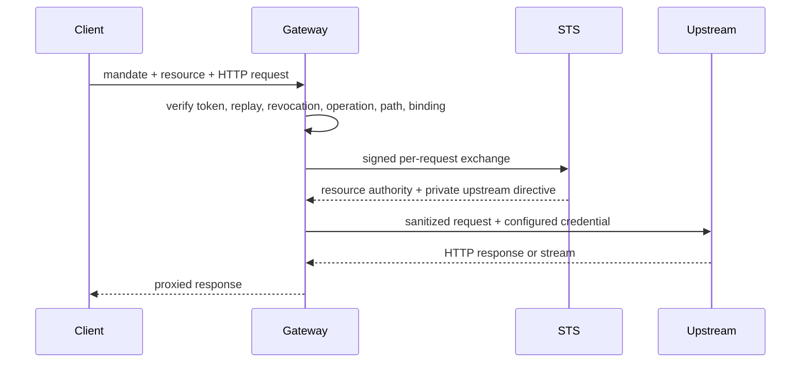

Gateway is the HTTP enforcement boundary for configured upstream resources. It listens on local port `8081`.

## Supported Request

A client sends an authorization bearer mandate, `X-Caracal-Resource`, and the intended HTTP request. Gateway resolves the configured zone/resource binding; callers do not select an arbitrary upstream.

## Deny Before Upstream

Gateway does not contact the upstream when the bearer is missing, malformed, oversized, expiring, replayed, revoked, or signature-invalid; the resource header or binding is missing; an enforced operation/scope is absent; the path traverses; STS fails or its circuit is open; or host safety rejects the destination.

It rejects caller-supplied `X-Caracal-Client-ID`, strips hop-by-hop and caller authorization headers, and applies only the upstream credential returned through the trusted exchange.

## Runtime and Protocol Limits

| Item               | Behavior                                                            |
| ------------------ | ------------------------------------------------------------------- |
| Liveness/readiness | `/health`, `/ready`                                                 |
| Monitoring         | `/metrics`, `/metrics.json`                                         |
| Request size       | `MAX_REQUEST_BYTES`, 10 MiB by default                              |
| HTTP streaming     | Supported, including SSE; revocation is rechecked between chunks    |
| WebSocket upgrade  | Not supported; upgrade headers are stripped                         |
| Revocation reload  | `POST /internal/revocations/reload`, service/operator-internal only |

Protect WebSocket services in process with a verification package or framework adapter.

## Dependency Implications

Gateway depends synchronously on STS and needs Postgres/Redis-backed binding, key, replay, and revocation state. It buffers audit evidence in replay storage if Redis/Audit delivery is unavailable. In published modes, replay/JTI and authority uncertainty fail closed; `JTI_FAIL_OPEN` is forbidden.

Use [Proxy Through Gateway](/api/gateway/) for the client contract and [Harden Production](/operations/tls-hardening/) for network placement.

## Next Step

[Ingest Audit Evidence](/services/audit/).
