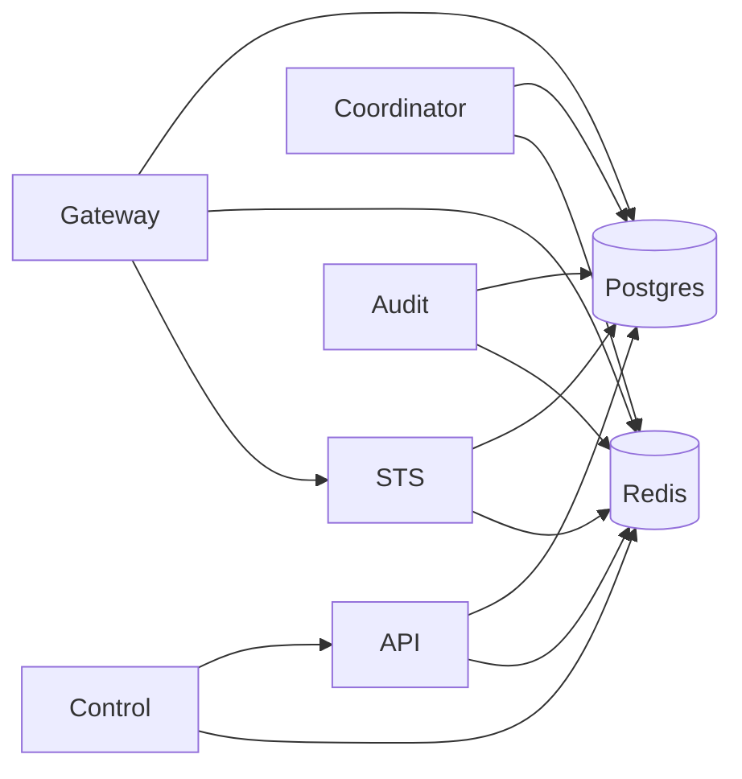

Caracal services are small, explicit runtime components. Each service owns a bounded part of the authority lifecycle and exposes health/readiness endpoints for operations.

## Service Map

| Service                                            | Port       | Owns                                                                               |
| -------------------------------------------------- | ---------- | ---------------------------------------------------------------------------------- |
| [Manage Product State](/services/api/)             | `3000`     | Product state, management routes, policy/grant resources, admin audit, API outbox. |
| [Coordinate Session State](/services/coordinator/) | `4000`     | Sessions, service leases, Delegations, invocations, Coordinator outbox.            |
| [Issue Mandates](/services/sts/)                   | `8080`     | Token exchange, mandate issuance, JWKS, policy evaluation, step-up status.         |
| [Protect Upstreams](/services/gateway/)            | `8081`     | Protected reverse proxy, per-request exchange, revocation checks, upstream safety. |
| [Ingest Audit Evidence](/services/audit/)          | `9090`     | Audit ingestion, DLQ, tamper checks, retention, search.                            |
| [Automate Management](/services/control/)          | API `3000` | Optional in-process remote management invocation through shared engine dispatch.   |

## Dependency Map

## Service Reading Path

| Path                    | Pages                                                                                       |
| ----------------------- | ------------------------------------------------------------------------------------------- |
| Management plane        | [Manage Product State](/services/api/) → [Coordinate Session State](/services/coordinator/) |
| Authority path          | [Issue Mandates](/services/sts/) → [Protect Upstreams](/services/gateway/)                  |
| Evidence and automation | [Ingest Audit Evidence](/services/audit/) → [Automate Management](/services/control/)       |

## Next Step

Start with [Manage Product State](/services/api/) to understand where Caracal product objects are owned.

## Related Sections

- [Understand Architecture](/architecture/)
- [Operations](/operations/)
- [Use API Reference](/api/)
