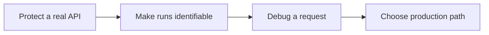

In [Get Started](/get-started/) your agent made one protected call to an LLM provider and you proved the full enforcement path. Tutorials make that setup yours. Working through them in order, you will:

1. **Protect a real API** - put Caracal in front of an HTTP service you actually run, and prove Caracal denies what policy does not allow.
2. **Make your runs identifiable** - label the calls your code makes, so you can tell one agent's work from another's in the audit trail.
3. **Debug on your own** - follow any request through the decision trail and answer "why was this allowed or denied?" without guessing.
4. **Choose your production path** - pick the one integration guide that matches how you will deploy for real.

Each tutorial builds on the previous one and tells you what to expect after every step. None of them repeats installation or first-call setup.

## Tutorial Path

| You will be able to... | Tutorial |
| --- | --- |
| Put Caracal in front of one HTTP service you own, and prove both the allow and the deny. | [Protect Your First Real API](./protect-an-api/) |
| Tell your agents' runs apart in the audit trail using labels. | [Make Runs Identifiable with Labels](./connect-an-agent/) |
| Explain any request's outcome from its decision trace. | [Trace One Protected Request](./inspect-a-run/) |
| Commit to one production integration boundary. | [Choose Your Production Integration Path](./choose-production-path/) |

## Before You Begin

You need the working setup from Get Started:

- a running stack - if you cleaned up earlier, run `caracal up` and wait for `caracal status --ready`;
- your zone, the Anton application, and its active policy;
- the working SDK example and `caracal.toml` profile from [Add SDK to Your App](/get-started/add-sdk-to-your-app/).

:::note
If any prerequisite is missing, return to [Get Started](/get-started/). Tutorials assume the evaluator stack already works.
:::

## After Tutorials

Use [Guides](/guides/) for task-specific implementation details, [SDKs](/sdks/) for package APIs, and [Concepts](/concepts/) when you need the reference model behind policy, delegation, revocation, or audit.
