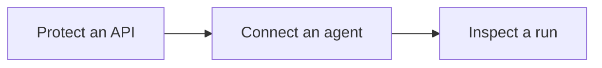

Tutorials turn the onboarding model into practical outcomes. Start with [Get Started](/get-started/) if you do not yet have a running stack and generated runtime profile.

## Tutorial path

| Outcome | Tutorial | What you use |
| --- | --- | --- |
| Put an enforced boundary in front of a service or provider route. | [Protect an API](./protect-an-api/) | Console **resource**, **provider**, **policy**, Gateway, connector guides. |
| Wire application code through Caracal. | [Connect an Agent](./connect-an-agent/) | TypeScript, Python, or Go SDK; generated runtime profile; Gateway. |
| Prove what happened during one run. | [Inspect a Run](./inspect-a-run/) | Console **agent session**, **session**, **delegation**, **audit**, and **explain** flows. |

## Before you begin

You should have:

- a local or deployed Caracal stack;
- one zone;
- one confidential agent app;
- one protected resource;
- one active policy set;
- a generated runtime profile or equivalent environment configuration.

The [Five-Minute Setup](/get-started/five-minute-setup/) creates all of these for a local evaluation path.

## After tutorials

Use [Guides](/guides/) for surface-specific implementation details, [SDKs](/sdks/) for package APIs, and [Concepts](/concepts/) when you need the reference model behind policy, delegation, revocation, or audit.
