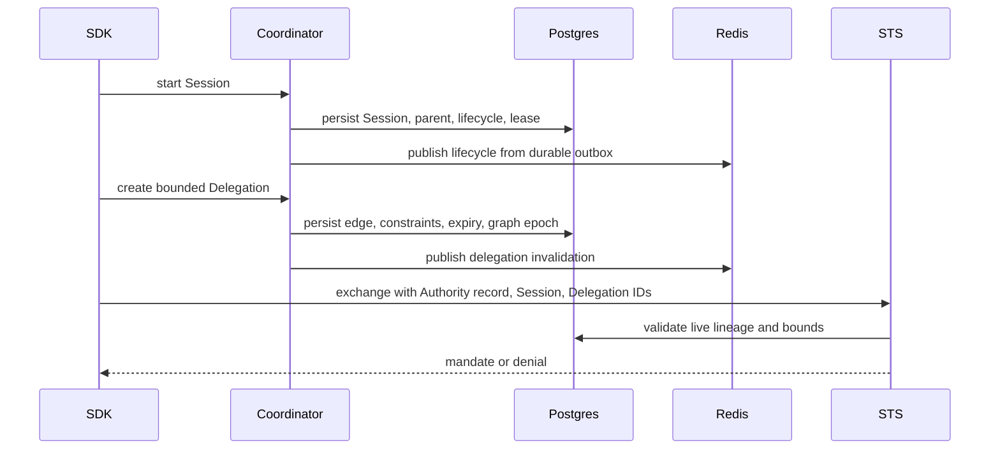

Use this flow when a request depends on execution lineage, long-lived leases, or authority delegated between Sessions.

## Session and Delegation Flow

## Choose a Session Lifecycle

Task Sessions use a TTL and expire. Service Sessions use heartbeat leases and become unhealthy when renewal stops. The process that owns a service Session must continue heartbeating; container liveness alone does not renew authority.

A Session tree records parent-child execution. Suspending or terminating a subtree affects governed execution state. A Delegation separately records exactly which resource, scopes, constraints, and expiry cross from one Session to another.

## Consistency and Failure

Coordinator writes state and outbox records durably in Postgres, then publishes lifecycle and invalidation events through Redis. A short propagation delay is possible. STS validates authoritative Session and Delegation state before issuing delegated authority, so a stale consumer view does not grant authority by itself.

Operational jobs expire stale task Sessions and Delegations, detect missed service leases, enforce invocation deadlines, publish outbox rows, and clean retained terminal data. Backlogged or dead outbox rows mean downstream views and revocation consumers can lag; surface that in Diagnostics before assuming the SDK failed.

## Operator and Integrator Surfaces

Applications use an SDK or the documented Coordinator API. Human operators use console **Sessions**, Delegation views, and Audit. Do not mutate Coordinator tables or publish lifecycle topics directly. Top-level `caracal` commands do not manage Sessions or Delegations.

## Next Step

[Propagate Events](/v0.2/architecture/event-streams/).
