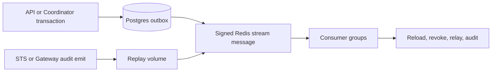

Redis Streams carries propagation, not the durable product model. This distinction explains why a committed change can exist before every consumer has observed it.

## Delivery Paths

API and Coordinator changes enqueue outbox rows in the same Postgres transaction as state. A dispatcher retries publication. Consumers use groups, pending-entry recovery, deduplication, and signed messages in published modes.

STS and Gateway cannot put audit evidence in the same database transaction as every decision. They write replay files when Redis delivery is unavailable and drain them after recovery.

## What Lag Means

| Observation                                                | Interpretation                                                                             |
| ---------------------------------------------------------- | ------------------------------------------------------------------------------------------ |
| Product read shows a change but a consumer has not reacted | Outbox or stream propagation is delayed.                                                   |
| Gateway or verifier still accepts revoked authority        | Check revocation snapshot, consumer lag, readiness, and verifier fail posture immediately. |
| Audit event appears later                                  | Check Audit consumer lag and replay backlog; do not assume evidence was never emitted.     |
| Dead outbox rows or old pending entries                    | Recovery needs operator action; readiness thresholds may fail.                             |

Postgres remains the recovery anchor. Redis is operationally important but is not a replacement for database backups.

## Canonical Topic Reference

[Use Event Topics](/v0.2/api/event-topics/) owns the topic, producer, and consumer-group list. Do not publish those topics from application code. They are service integration contracts, not a public event bus for workloads.

## Next Step

[Store State](/v0.2/architecture/storage-model/).
