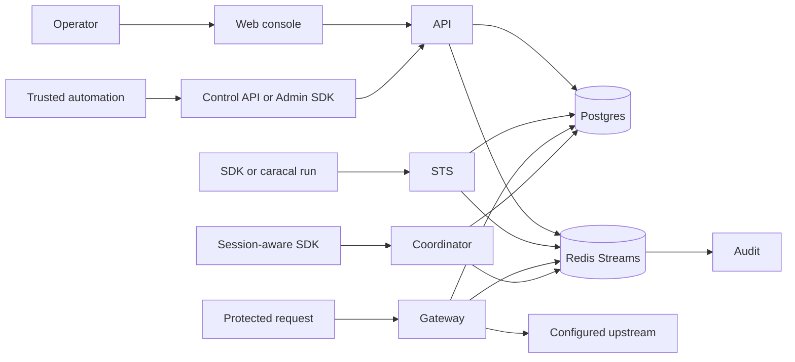

You do not need this section to complete normal console setup. Use it when selecting an enforcement boundary, tracing a failed request, planning dependencies, or recovering state.

## Operational Model

The web console, through its auth backend, is the human management surface; the API applies product and policy changes for it and for trusted automation. Postgres is durable state. Redis Streams propagates events and invalidations. STS decides and issues authority. Gateway enforces before an upstream call. Coordinator makes execution lineage explicit. Audit turns signed events into evidence.

That separation creates useful failure boundaries: management can be unavailable without changing already-issued token expiry; Audit can lag while requests continue to emit replayable evidence; Redis can recover propagation from durable outboxes; Gateway denies when it cannot establish current authority.

## Choose the Flow You Need

| Question                                                    | Read                                                  |
| ----------------------------------------------------------- | ----------------------------------------------------- |
| Which clients may call which surfaces?                      | [Map the System](/v0.2/architecture/system-topology/)      |
| What happens before a mandate is issued?                    | [Exchange Tokens](/v0.2/architecture/token-exchange-flow/) |
| How do Sessions and Delegations affect authority?           | [Coordinate Sessions](/v0.2/architecture/delegation-flow/) |
| Why can state be current in Postgres but delayed elsewhere? | [Propagate Events](/v0.2/architecture/event-streams/)      |
| What must be backed up or restored first?                   | [Store State](/v0.2/architecture/storage-model/)           |
| Which key protects which trust transition?                  | [Manage Keys](/v0.2/architecture/crypto-keys/)             |
| Where must a deployment fail closed?                        | [Enforce Boundaries](/v0.2/architecture/trust-boundaries/) |

## Supported Integration Surfaces

Integrators call the SDKs, STS token endpoint, Gateway proxy, documented Coordinator API, Admin API, or optional Control API according to the task. Internal endpoints, databases, Redis topics, replay files, and retained schema names are implementation boundaries, not application APIs.

## Next Step

[Map the System](/v0.2/architecture/system-topology/).
