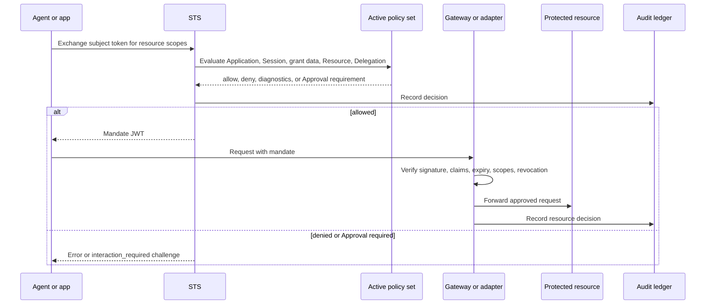
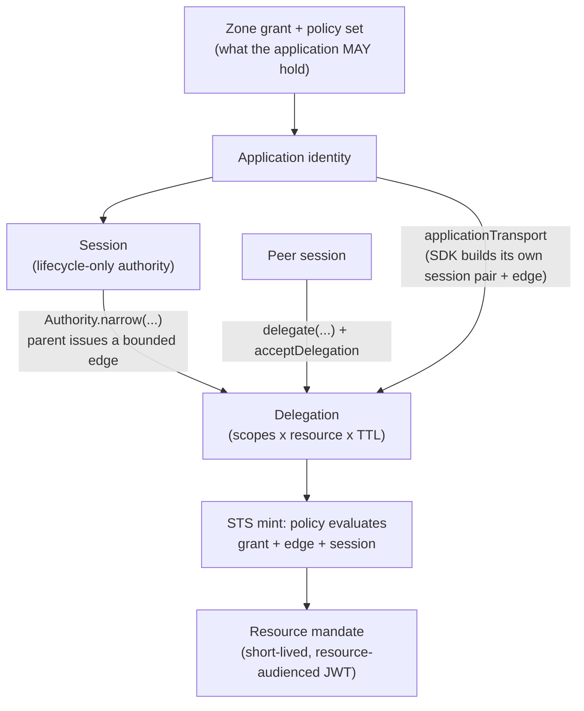

Use this page to choose where Caracal makes and enforces an authorization decision. First understand [Caracal Mental Model](/v0.2/concepts/model-overview/).

Caracal separates **granting authority** from **using authority**.

* The STS grants authority by issuing a short-lived mandate after policy evaluation.
* The Gateway or adapter uses authority by verifying the mandate before forwarding a request or running a tool.

## Enforcement Flow

## Control Layers

| Layer              | Responsibility                                                   | Source of truth                    |
| ------------------ | ---------------------------------------------------------------- | ---------------------------------- |
| Zone               | Owns keys, policies, resources, sessions, and audit data.        | Console or Admin API               |
| Grant data         | Declares which Application roles may request Resource scopes.    | Console or Admin API               |
| Policy set         | Makes the final allow, deny, or Approval decision.               | Rego policy versions               |
| Mandate            | Carries approved authority as a short-lived signed JWT.          | STS                                |
| Gateway or adapter | Verifies mandate claims and revocation before use.               | Runtime and resource server config |
| Audit ledger       | Records decisions, diagnostics, and request correlation.         | API, Console, and storage          |

## Where Resource Authority Comes From

A Session does not receive Resource authority merely because it exists. Application-owned calls use the SDK's bounded call path. Agent work receives a narrowed Delegation. Both paths still require active policy approval before Caracal issues a Mandate.

Common mistake: treating a Session as a permission grant. A Session supplies lifecycle and attribution. Use an Application-owned call for ordinary app work, or attach a narrowed Delegation when a child or peer must hold less authority.

## Default Posture

Caracal should be treated as deny-by-default:

1. A resource must be registered.
2. The Application must have an applicable grant-data or Delegation path.
3. The active policy set must allow the requested resource and scopes.
4. The resource server must verify the mandate and revocation anchors.

Missing configuration, invalid signatures, expired mandates, insufficient scopes, revoked sessions, and failed delegation checks all stop the request.

## Gateway and Adapter Roles

Use the Gateway when you want Caracal to front an HTTP upstream and mediate requests centrally. Use an adapter when the resource server should verify mandates inside its own framework, such as Express, FastMCP, or net/http, or use the verify engine directly for custom boundaries.

Both patterns share the same authority model. The difference is only where mandate verification runs.

## Enforce, Propagate, or Attribute

The SDK exposes several call paths. They are not interchangeable: each does a different job, and only some **enforce** authority. Pick by what you need at that boundary.

| Call path                                                                                    | Role          | Verifies the mandate?                                              | Use when                                                                         |
| -------------------------------------------------------------------------------------------- | ------------- | ------------------------------------------------------------------ | -------------------------------------------------------------------------------- |
| SDK request through the Gateway                                                             | **Enforce**   | Yes - the Gateway verifies claims and revocation before forwarding | Caracal fronts an HTTP upstream and mediates centrally                           |
| Direct Gateway call (`curl` to the Gateway URL)                                              | **Enforce**   | Yes - same Gateway verification                                    | Non-SDK clients or debugging the enforced path                                   |
| Adapter verify (`context_middleware(verifier=…)`, Express, FastMCP, net/http, verify engine) | **Enforce**   | Yes - the adapter verifies inside the resource server              | The resource server should enforce in its own framework                          |
| `caracal.transport` / `context_middleware()` (no verifier)                                   | **Propagate** | No - carries and binds the envelope only                           | A Gateway or adapter already enforced upstream and you only need context to flow |
| App-managed provider call (your code calls the provider SDK directly)                        | **Attribute** | No - Caracal records who acted, but does not gate the call         | You want audit attribution without routing through the Gateway                   |

Rule of thumb: **use the Gateway or an adapter verifier to enforce; use transport/propagation to carry identity after enforcement; treat app-managed provider calls as attribution only.** If a path says "no" under *verifies the mandate*, something upstream must have already enforced it.

## Outcome

You should be able to name the decision point, the enforcement boundary, and whether a proposed call path enforces, propagates, or only attributes authority.

## Next Step

Read [Zones](/v0.2/concepts/zone/) to understand the tenant boundary that owns authority data.

## Related Pages

* [Policies and Policy Sets](/v0.2/concepts/policy/) explains the decision contract.
* [Mandates](/v0.2/concepts/mandate/) explains the issued token.
* [Sessions and Revocation](/v0.2/concepts/sessions-revocation/) explains how active authority ends.
