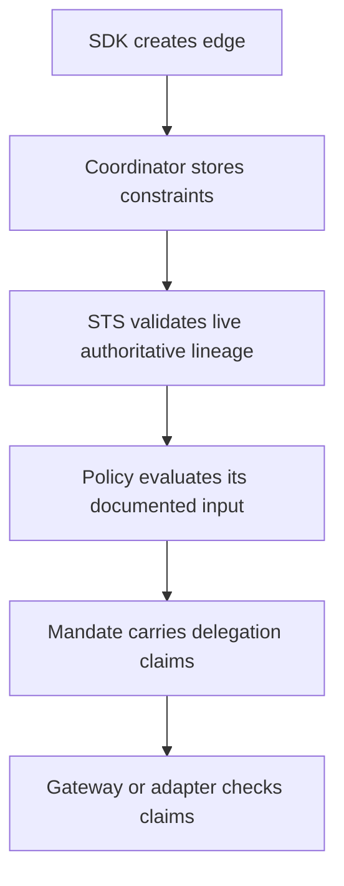

Read [Session Delegation](/v0.2/concepts/delegation/) first. Constraints state how far, how long, and for what a Delegation may be used. Caracal validates them when the Delegation is created and again before issuing a Mandate through it.

## Constraint Types

| Constraint       | Use it to limit                                             |
| ---------------- | ----------------------------------------------------------- |
| Resource         | Which protected target can be reached.                      |
| Scopes           | Which actions can be requested.                             |
| TTL              | How long the delegated edge remains useful.                 |
| Hop count        | How deep the delegation chain may become.                   |
| Approval metadata | Audit/display annotation; it does not authorize the edge.    |
| Broad reason      | Audit/display note for an elevated resource-unbounded edge.  |

## Example Shape

```json
{
  "resource": "resource://piperchat",
  "scopes": ["piperchat:read", "piperchat:comment"],
  "max_hops": 2,
  "expires_at": "2026-06-01T12:00:00Z",
  "policy_approved": true
}
```

Delegation constraints bound authority, lifetime, and propagation. They are not quotas: the wire accepts a `budget` field, but it is a narrowing bound - a child edge's budget can never exceed its parent's - not a per-call counter, and no constraint performs usage accounting. Use a domain-specific store when calls, work, or cost must be consumed atomically. Approval metadata and broad-reason fields are audit annotations; they do not authorize the Delegation.

Application-chain requirements are verifier options rather than edge constraints. Use `requireChainContains` at a resource boundary when a specific application must appear in the signed delegation chain.

## Where Constraints Are Enforced



## Design Guidance

* Put durable business rules in policy data documents.
* Put per-edge runtime limits in constraints.
* Prefer positive allowlists over open-ended deny lists.
* Keep constraints small enough to review in audit traces.
* Use consistent field names across agents so policies stay readable.

## Next Step

Read [Sessions and Revocation](/v0.2/concepts/sessions-revocation/) to understand how active authority ends.

## Related Pages

* [Session Delegation](/v0.2/concepts/delegation/)
* [Policies and Policy Sets](/v0.2/concepts/policy/)
* [Implement Multi-Agent Delegation](/v0.2/guides/delegation/)
