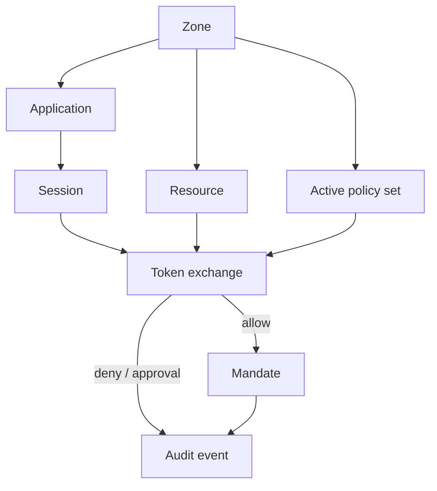

Caracal answers one question: **should this Application receive scoped authority for this Resource right now?**

It answers that question during token exchange, records the decision, and returns a mandate only when the active policy set allows the request.

## Before You Begin

Know the Application and Resource from Get Started. No protocol knowledge is required.

## Eight Core Nouns

| Noun        | What it means                                                                      |
| ----------- | ---------------------------------------------------------------------------------- |
| Zone        | The trust boundary for configuration, signing keys, policy, Sessions, and audit. |
| Application | Registered software that authenticates to Caracal.                                |
| Subject     | An optional identity federated from your identity provider for attribution.        |
| Session     | One governed execution under an Application.                                       |
| Resource    | The protected target: API, MCP server, tool group, or upstream service.            |
| Provider    | Sealed custody of a Resource's upstream credential, attached only after approval.  |
| Policy      | Versioned data the platform decision contract evaluates during exchange.           |
| Mandate     | The short-lived signed proof accepted by the Gateway or a verified service.        |

Get Started introduced Application, Resource, Provider, Policy, Mandate, Gateway, Audit, and Zone; this model adds the two runtime nouns behind them - Session and the optional Subject. Most of these are configured directly. A *grant* is a permission binding for resource scopes that policy can read during evaluation; it is not the mandate a resource server verifies.

## One Application, Many Sessions

An application and a Session are different layers, and they scale differently:

* An **application** is the credentialed security boundary - operator-provisioned or dynamically registered, holding the secret Caracal authenticates. It is created deliberately.
* A **Session** is the governed execution unit - started the moment your software acts, with no secret and no registration step.

One application backs many Sessions. A long-running service registers **one managed application**, then starts, delegates, and fans out as many Sessions as it needs under that single credential. You do not create an application per AI agent; per-execution attribution comes from the Session, not a new application. See [Should I create one application per agent?](/v0.2/reference/faq/#faq-006).

## Three Runtime Verbs

| Verb     | Meaning                                                                                                    |
| -------- | ---------------------------------------------------------------------------------------------------------- |
| Exchange | Ask the STS to convert existing identity into a resource mandate.                                          |
| Start    | Open a governed Session, optionally attaching a Subject authority record ID for attribution and lifecycle. |
| Delegate | Pass constrained authority from one Session to another.                                                    |

## One Decision Point

Caracal evaluates the active policy with the Application, Authority record, Session, Resource, scopes, Delegation, and Approval context. If policy allows the request, Caracal signs a Mandate. If policy denies it, no Mandate is issued.

A federated Subject can be attached for attribution and supported Subject approval flows. Federation does not create a separate per-Subject permission system: Resource authority still comes from the Application, policy, and any Delegation.

Resource servers still verify mandates locally through the Gateway or adapters. That keeps every request protected even after token exchange succeeds.

## Why This Model Matters

* Long-lived provider secrets stay out of agents.
* Authority expires quickly and can be revoked.
* Delegation carries typed constraints instead of informal trust.
* Every allow, deny, Approval, and revocation path is auditable.

## Outcome

You should be able to separate durable Application identity, optional Subject attribution, temporary Session execution, and short-lived Mandates.

Next, read [Authority and Enforcement](/v0.2/concepts/authority-model/) to see where each enforcement layer fits.
