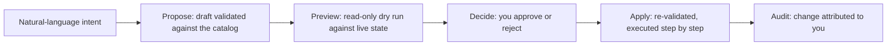

Read this page only if you plan to use the optional Caracal Operator in the web console. It turns natural-language intent into a previewed plan and applies that plan through the same guarded APIs available to the human operator. It introduces no new authority.

## Why It Exists

Most control-plane work is a sequence of small, related changes: register an application, connect a provider, define a resource and its scopes, then activate the policy that ties them together. The Operator collapses that into a described outcome while keeping every safety property - validation, least privilege, approval, and audit - in the platform rather than the model.

The Operator works against a **capability catalog**: the set of control-plane actions it can take, grouped by the objects you operate - zones, applications, providers, resources, access, and policy. Each capability is classified as read-only or state-changing, so a request that only inspects state is always distinguishable from one that changes it.

## The Governed Lifecycle

A change never applies directly from natural language. Within a session the Operator follows a fixed lifecycle, and the language model only ever produces a draft that enters it:

1. **Propose.** Intent becomes a plan whose every step is validated against the capability catalog. A step that names an unknown action or invalid arguments is rejected before anything runs.
2. **Preview.** The plan is resolved against your live state as a read-only dry run, so each step is marked as a create, an update, a no-op, or blocked when a referenced object is missing. Nothing is written.
3. **Decide.** You approve or reject the plan. A plan is decided once, and only an approved plan is eligible to apply.
4. **Apply.** An approved plan is re-validated and re-previewed, then executed step by step. A plan applies only once, and any secret it produces is surfaced in the apply response, never written to the conversation or the audit log; issued credentials stay retrievable from Secret Store custody through the owning object's audited reveal.

## Authority and Isolation

The Operator runs as a reserved Application, distinct from the human operator who approves a plan. Audit records both the human decision and the Operator Application that executes the change.

That delegated authority is least-privilege: the Operator may execute only the capabilities explicitly granted to it. A plan that asks for a capability outside its grant is refused as forbidden, before execution. The Operator is also bounded by zone isolation - it will not open a session in, or execute against, a [system zone](/v0.2/concepts/zone/#system-zone), keeping its authority away from the infrastructure that runs Caracal itself.

## Ask and Agent Modes

Every conversation runs in one of two modes, enforced by Caracal and never chosen by the model:

| Mode | What the Operator can do |
| --- | --- |
| Agent | Answer questions, read state, and propose plans that apply changes after your approval. |
| Ask | Strictly read-only: explain, investigate, and diagnose. It never produces a plan and cannot apply anything. |

Ask mode is enforced in two independent places - the planning skill is never selected, and the change endpoints refuse outright - so a read-only conversation is provably write-incapable.

## Autopilot

In agent mode you can engage **autopilot**, which lets Caracal auto-satisfy the approval step for every plan in the conversation. Engaging it is an explicit opt-in to acting without a human in the loop; it is off by default and per conversation, and a platform-level master switch must also be on. Auto-approval never widens authority - the governed execute path still enforces the capability allowlist, the least-privilege executor token, and zone isolation on every apply. Autopilot defers while a plan still needs credentials from the console's secure prompt and stops when a preview shows the plan cannot apply. A deployment can also bound an engaged conversation with a **write budget**: once the cumulative auto-approved write operations would exceed it, autopilot pauses, records the pause in the conversation ledger, and the plan waits for explicit human approval. The master switch is a single kill switch that stops all auto-approval on the next turn.

## Authoring Policy

Policy is the densest control-plane object to write by hand: a decision rests on grant, binding, and confinement data that must parse as valid Rego and satisfy the platform decision contract. The Operator includes a dedicated policy author for exactly this. Describe the access you want - which application owns a resource, which roles hold which scopes, how to confine a label - and it drafts the matching [data documents](/v0.2/concepts/policy/), explains each one, and reports the least-privilege posture, the risks it detected, ready-to-run simulations, and activation readiness.

Every draft is validated and previewed against the same contract the platform enforces, so a document the Operator emits is already contract-valid; if it cannot produce a valid document it fails closed rather than returning broken Rego. A draft is not a change. Turning one into a policy runs the ordinary [governed lifecycle](#the-governed-lifecycle) - you review the proposed create, approve it, and the create is re-validated on apply and attributed to you. Policies authored this way carry provenance marking them AI-assisted, and their later version, simulation, and activation steps stay under the same review and audit as any other policy work.

## Natural-Language Provider

Turning words into a plan requires a model endpoint supplied by the operator. Open **Settings → AI Operator → Models** to add an OpenAI chat-completions-compatible endpoint, model IDs, optional context window, and key placement. The API key is accepted only when the provider is created or rotated, sealed into a credential Provider in the reserved `caracal.sys` Zone, and never returned to the browser. Operator model calls use the governed Gateway route for that Resource.

The settings page can edit provider metadata, rotate the sealed key, delete a provider, and run a real connectivity check. Multiple providers and models participate in failover. Direct API-process `API_OPERATOR_AI_*` configuration also remains implemented, but the packaged-runtime workflow is console management; see [Configure Service Environment](/v0.2/operations/env-vars/#api-operator-and-control) for that narrower path.

## Where to Use It

Open **Caracal Operator** from the console utility rail or command palette. For the workspace and provider-management paths, see [Caracal Operator](/v0.2/runtime-console/console/#caracal-operator) in the web console reference.

## Common Mistakes

* Ask mode is read-only; it cannot produce or apply a change plan.
* Approval of one plan does not widen the Operator Application's capability grant.
* Autopilot changes who satisfies the plan Approval; it does not bypass validation, Zone isolation, or audit.

## Related Pages

* [Zones](/v0.2/concepts/zone/) for the system zone the Operator self-governs.
* [Policies and Policy Sets](/v0.2/concepts/policy/) for the data documents a plan can author.
* [Audit and Request Traces](/v0.2/concepts/audit-ledger/) for the trail every applied change leaves.
