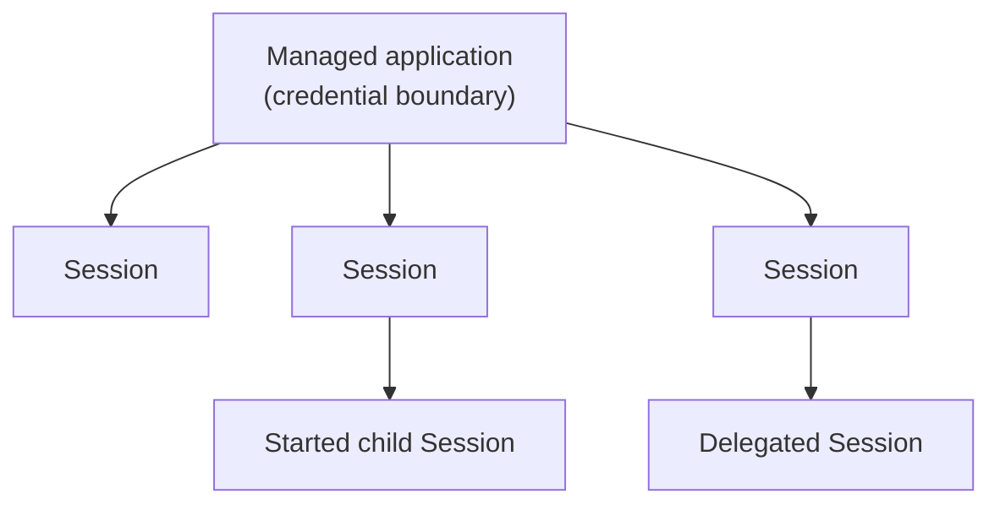
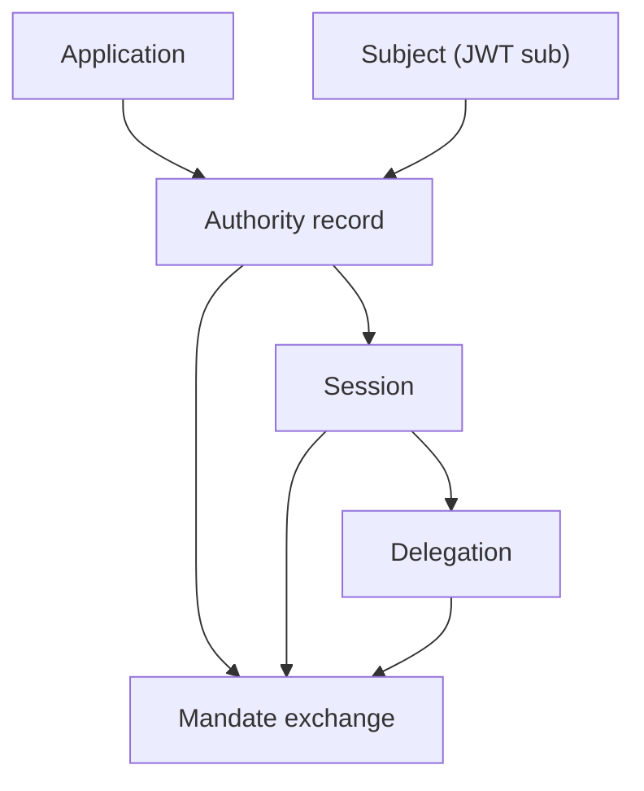

Use this page to decide which identity is durable, which identity is optional, and which record identifies one execution.

An **Application** is registered software that authenticates to Caracal. A **Subject** is an optional identity federated from your identity provider. An **Authority record** is an immutable record of identity and authority context. A **Session** is one governed execution under an Application.

## Identity and Execution Objects

When you need the operator-facing view of these objects side by side - including how their IDs appear on the wire - the identity table in [Manage Runtime Authority](/v0.2/runtime-console/agents/#keep-the-identities-distinct) is the quick reference.

| Public object    | Typical source                                | What it controls                                                                                                           |
| ---------------- | --------------------------------------------- | -------------------------------------------------------------------------------------------------------------------------- |
| Application      | Workload credential or Application secret     | The durable credential and policy boundary for software.                                                                  |
| Subject          | Token from your registered identity provider  | Attribution, provider connection ownership, revocation anchor, and supported Subject approvals; not scope authority alone. |
| Authority record | Successful identity or authority exchange     | Immutable audit and revocation context.                                                                                    |
| Session          | SDK runtime primitive                         | The lifetime and exact attribution of one governed execution.                                                              |

No identity object authorizes a Resource by itself. A request still needs Resource scopes, applicable policy, and any required Delegation or Approval.

## Application Roles

Applications represent software that can participate in Caracal flows:

* an agent runtime that starts child Sessions;
* a backend service that requests mandates;
* a Gateway application that fronts protected upstreams;
* an adapter-protected resource server;
* a managed or dynamically registered client.

Applications have registration metadata, a server-owned credential, and a registration method. **Managed** Applications are durable and operator-provisioned for known software, including runtimes that start child Sessions. **DCR** Applications (Dynamic Client Registration) are auto-expiring and created programmatically when a separate temporary credential boundary is needed, not for ordinary Session fan-out.

## Applications Are the Credential Boundary; Sessions Are the Runtime Unit

An application is registered, holds a server-owned secret, and is the identity Caracal authenticates. A Session is started at runtime by the process that already holds that secret; it carries parent, Subject authority record ID, labels, and delegation context. One application backs many Sessions, so a long-running service uses **one managed application** and starts, delegates, and fans out as many Sessions as it needs. You do not register an application per AI agent - see [Should I create one application per agent?](/v0.2/reference/faq/#faq-006).

## Managed and DCR Applications

| Kind          | Use it for                                                        | Rule                                                                                                   |
| ------------- | ----------------------------------------------------------------- | ------------------------------------------------------------------------------------------------------ |
| Managed (durable)       | A service, orchestrator, Gateway, or agent runtime                 | Create once and reuse across many Sessions for the same service.                                      |
| DCR (auto-expiring) | An isolated credential boundary for a tenant or integration       | Create programmatically; it expires, binds to one task Session, and cannot participate in a child tree. |

Sessions use one of two lifecycles: a **task Session** ends with a bounded unit of work, while a **service Session** stays active through a heartbeat lease. Lifecycle describes time, not actor type or authority.

A task Session may have a wall-clock TTL. A service Session ends when its heartbeat lease lapses or it is closed. Keeping the lease alive does not widen authority.

Two structural rules prevent invalid trees:

* A `task` parent cannot start a `service` child. The protocol reports `task_session_cannot_start_service`. A `service` parent may start either lifecycle.
* A DCR Application's Session is a **leaf**: it cannot parent or be a child Session.

A short-lived worker is an ordinary task Session with a TTL. Model an orchestrator and its workers under one managed Application unless they need separate credentials or mutual distrust boundaries.

* the orchestrator is the top-level Session, or a [`start_session()`](/v0.2/sdks/python/) handle when it needs a heartbeat lease,
* each manager is a plain `session()` that inherits the application's authority,
* each task worker is `session(authority=Authority.narrow([...]), ttl_seconds=…)` - least-privilege and auto-terminated on block exit, with the TTL sweeper as a backstop.

Use a DCR Application for credential isolation, not Session fan-out. It authenticates independently; it is not started as a child Session.

:::note[FAQ]
[What is the difference between an application, principal, and Session?](/v0.2/reference/faq/#faq-005) and [when should I use a managed application versus DCR?](/v0.2/reference/faq/#faq-007)
:::

Policy and audit can distinguish Application kind, Session lifecycle, labels, parentage, and Delegation context.

## Telling Sessions Apart

Every Session has one canonical Session ID. SDK context exposes it as `sessionId`, `session_id`, or `SessionID`. It is returned when `session()` or `startSession()` starts the Session and is stamped onto its token exchanges and audit events.

`labels` are descriptors, not identity. Many Sessions under one application can intentionally share labels. Use labels, metadata, or a trace ID for business correlation; use Session ID for exact attribution.

The Admin API audit endpoint filters by `session_id` for one Session or `label` for a role across many Sessions.

## Subject Federation Is Attribution, Not a Permission Store

Caracal verifies a Subject token only from a Subject issuer registered in the Zone. The resulting Authority record can be attached to a Session as immutable attribution and as a revocation anchor. Supported Subject approval flows can also require that federated identity.

Caracal does **not** derive per-Subject Resource scopes from federation. Do not claim that attaching Richard Hendricks authorizes a call. The Application, active policy, requested scopes, and any Delegation still determine authority.

## Sessions Bind Identity to Time

Authority records, Sessions, and Delegations make authority revocable. Mandates carry their identifiers as revocation anchors.

## Naming Guidance

* Use **Application** for registered software and **Subject** for optional federated identity in user-facing material.
* Use **Subject** for the JWT `sub` identity.
* Use **Authority record** for an STS exchange record.
* Use **Session** for a governed Coordinator execution.
* Avoid using "client" unless you are describing OAuth protocol fields.

## Next Step

Read [Resources and Grants](/v0.2/concepts/resource-grant/) to understand what identities can request.

## Related Pages

* [Sessions and Revocation](/v0.2/concepts/sessions-revocation/)
* [Session Delegation](/v0.2/concepts/delegation/)
* [Integrate the TypeScript SDK](/v0.2/guides/sdk-typescript/)
