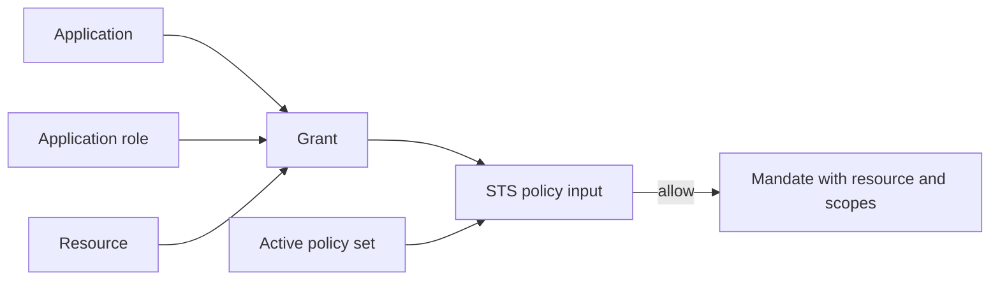

Use this page to separate the protected target from the policy data used to evaluate access. A Resource is something Caracal protects. Grant data maps an Application role to scopes for that Resource.

## Resources

Resources describe protected targets such as:

* HTTP APIs behind the Gateway;
* MCP servers and tool groups;
* internal services protected by Express, FastMCP, or net/http adapters;
* provider-backed targets that need credential mediation.

| Resource field | Purpose |
| --- | --- |
| Identifier | Stable policy and token audience target. Always use the `resource://<slug>` convention, such as `resource://pipernet`; keep it stable even when the upstream URL changes. |
| Upstream URL | Gateway forwarding target. |
| Scopes | Named Caracal resource actions that policies and mandates can constrain. |
| Gateway application | Managed application identity used by Gateway-mediated resources. |
| Upstream credential provider | Resource binding to the provider record used when Gateway attaches no credential, a Caracal mandate, OAuth tokens, API keys, or bearer tokens. |

:::note[FAQ]
[What is the difference between a resource and a provider?](/v0.2/reference/faq/#faq-009) and [why must the resource identifier stay stable?](/v0.2/reference/faq/#faq-010)
:::

## Grants

A grant data entry binds an Application key and role to a Resource and one or more scopes. It is not a Mandate and it is not a per-Subject permission assignment.

Grants are not the final decision. They are one input to Policy. The active Policy set can still deny, require Approval, or constrain the exchange.

Caracal also stores administrative records associated with Subjects for lifecycle and revocation workflows. Those records do not feed per-exchange scope decisions. Subject-specific upstream accounts are credential Provider connections, not Caracal authorization grants.

## Exchange Relationship

## Scope Design

Prefer small, action-oriented scopes:

| Good | Avoid |
| --- | --- |
| `pipernet:read` | `admin` |
| `piperchat:comment` | `write_all` |
| `nucleus:tool:call` | `tools` |

Use Resource identifiers for targets and scopes for actions. Do not encode environment, tenant, or Subject identity into scope names when those belong in the Zone or decision context.

:::note[FAQ]
[How should I design scopes?](/v0.2/reference/faq/#faq-011) and [do I manage grants directly?](/v0.2/reference/faq/#faq-012)
:::

## Next Step

Read [Providers](/v0.2/concepts/provider/) to understand the credential Caracal attaches when it calls the upstream target.

## Related Pages

* [Define Resources and Providers](/v0.2/guides/resources-providers/)
* [Model Your Application in Caracal](/v0.2/guides/modeling-recipes/)
* [Debug Authorization Decisions](/v0.2/guides/authorize-access/)
