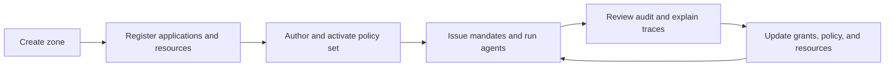

Use this page when deciding what must be isolated from what. A Zone is Caracal's main trust boundary: it groups the identities, policy, Resources, keys, runtime authority, and audit evidence that must share one administrative boundary.

## What a Zone Owns

| Area          | Zone-owned data                                                              |
| ------------- | ---------------------------------------------------------------------------- |
| Identity      | Applications, credentials, Authority records, and Sessions.                  |
| Authorization | Resources, Providers, grants, policies, policy sets, and Approvals.           |
| Cryptography  | Zone signing keys and JWKS used to verify mandates.                          |
| Delegation    | Delegations, constraints, depth limits, and cascade revocation state.        |
| Audit         | Decision events, diagnostics, request IDs, and explain traces.               |

## Why Zones Exist

Zones let teams run separate environments, tenants, or trust domains without mixing authority data.

Common zone boundaries include:

* production, staging, and development environments;
* separate customers in a hosted deployment;
* isolated product areas with different policy owners;
* high-sensitivity resources that need distinct keys and audit trails.

When several boundaries could apply at once, use [Model Your Application in Caracal](/v0.2/guides/modeling-recipes/) to choose between a separate zone, a shared zone with separate resources, and a customer attribute in policy input. To serve many of your own customers from one zone, follow [Serve Your Own Customers](/v0.2/guides/serve-customers/).

:::note[FAQ]
[What should a zone represent?](/v0.2/reference/faq/#faq-003)
:::

## Zone Lifecycle

Zone setup is normally managed through the web console. The Admin API exposes the same objects for automation.

## Key and Policy Isolation

Each zone has its own signing-key and JWKS context. Resource servers verify mandates against the issuer, audience, and expected zone. Policy activation is also zone-scoped: activating a policy set in one zone does not affect another zone.

## Advanced Application Registration

A Zone can allow programmatic registration of auto-expiring **DCR Applications** (Dynamic Client Registration). This is off by default and is for separate credential boundaries, not ordinary Session fan-out. The console does not create these Applications.

Disabling registration while live DCR Applications exist requires an explicit decision:

| Choice      | Effect                                                                                                                                 |
| ----------- | -------------------------------------------------------------------------------------------------------------------------------------- |
| Keep live   | Blocks new registrations; existing DCR applications stay valid until their own expiry.                                                 |
| Revoke live | Blocks new registrations and immediately archives live DCR applications, revoking their sessions and terminating related agent access. |

The console prompts for this choice. Use the Admin API reference when automating it.

## System Zone

Caracal reserves one **system zone** for the infrastructure that runs the platform itself, distinct from the tenant zones you create. It carries the reserved `caracal.sys/` namespace and is provisioned by the bootstrap admin identity, so a tenant can never create, author, or impersonate the objects inside it.

The [Caracal Operator](/v0.2/concepts/operator/) self-governs through this zone: its reserved control identity, least-privilege control grants, and the providers and resources that route its model calls all live there. The Operator will not open a session in, or execute against, the system zone, so its delegated authority stays away from the infrastructure that runs Caracal. An administrator can also mark additional zones as system zones to place them out of the Operator's reach.

## Operational Guidance

* Keep production and non-production authority in separate zones.
* Name zones after the trust boundary, not a single service.
* Keep resource identifiers stable because policies, grants, and audit traces refer to them.
* Rotate zone signing keys using the operations workflow, then confirm resource servers load the current JWKS.

## Next Step

Read [Identities and Applications](/v0.2/concepts/principal/) to understand who acts inside a zone.

## Related Pages

* [Resources and Grants](/v0.2/concepts/resource-grant/)
* [Model Your Application in Caracal](/v0.2/guides/modeling-recipes/)
* [Audit and Request Traces](/v0.2/concepts/audit-ledger/)
