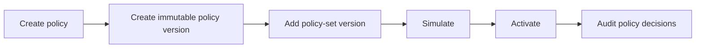

Use this guide when validated policy data must become live. The job is complete only after simulation, activation, propagation, and a real audited exchange; creating a policy version alone changes no authorization result.

## Prerequisites

* A validated policy version and representative allow and deny inputs.
* A policy set in the target zone and the current active version recorded for rollback.
* Console access or an Admin client in a trusted automation environment.

## The mental model

Four immutable layers separate authoring from what runs:

| Layer | What it is | Mutable? |
| --- | --- | --- |
| Policy | A named Rego document. | The name; content is versioned. |
| Policy version | One immutable snapshot of policy content. | No. |
| Policy-set version | An immutable bundle of policy versions. | No. |
| Active policy-set version | The one bundle the STS evaluates for a zone. | The pointer moves on activation. |

You edit by creating a **new** version and moving the active pointer to it.
Nothing already evaluated is ever rewritten, so every audit decision ties back to
the exact policy-set version and manifest hash that produced it.

A zone is governed by exactly one policy set at a time. Activating a version of
one set deactivates any other set in the zone in the same transaction, so which
policies govern a zone is never ambiguous. Saving or activating a version also
compiles the full policy bundle on the STS runtime engine, so a manifest whose
policies conflict (for example, two documents defining the same data key) is
rejected before it can be pinned or promoted.

## Activation flow



## Web Console Workflow

1. Open the web console for your deployment.
2. Select **Policies** and create or update the Rego policy.
3. Select **Policy Sets** and create a set for the zone.
4. Add the policy version to a new policy-set version.
5. Simulate the version with a representative input.
6. Activate the version when the simulated decision matches the intended behavior.
7. Use **Audit** to follow the decision trace after the first real request.

## Automation workflow

```ts
import { AdminClient } from "@caracalai/admin";

const admin = new AdminClient({
  apiUrl: process.env.CARACAL_API_URL!,
  adminToken: process.env.CARACAL_ADMIN_TOKEN!,
});

const policy = await admin.policies.create(process.env.CARACAL_ZONE_ID!, {
  name: "pipernet-read",
  content: policySource,
});

const set = await admin.policySets.create(process.env.CARACAL_ZONE_ID!, "pipernet");
const version = await admin.policySets.addVersion(process.env.CARACAL_ZONE_ID!, set.id, [
  { policy_version_id: policy.version.id },
]);

const simulation = await admin.policySets.simulate(process.env.CARACAL_ZONE_ID!, set.id, version.id, sampleInput);
if (!simulation.would_activate) {
  throw new Error(simulation.explanation.reason);
}

await admin.policySets.activate(process.env.CARACAL_ZONE_ID!, set.id, version.id);
```

## Wait for propagation

Activation returns `202 Accepted`: the active pointer moves durably, then the
STS runtime reloads the bundle through a durable invalidation stream. Poll the
activation status until the runtime reports the version as loaded before
treating the rollout as live:

```ts
let status = await admin.policySets.activationStatus(zoneId, set.id, version.id);
while (status.propagation_status !== "loaded") {
  if (status.propagation_status === "failed") {
    throw new Error(status.outbox.last_error ?? "policy rollout failed");
  }
  await new Promise((resolve) => setTimeout(resolve, 2000));
  status = await admin.policySets.activationStatus(zoneId, set.id, version.id);
}
```

`propagation_status` moves through `waiting_for_outbox` → `waiting_for_sts` →
`loaded`. With several STS replicas, the replica that receives the invalidation
reloads within about a second; the rest converge through a periodic database
poll (60 seconds by default), so a brief mixed-version window across replicas
is expected during rollout.

## Validation checklist

| Check | Expected result |
| --- | --- |
| Policy validation | `valid: true` and no blocking warnings. |
| Simulation | Representative input returns the intended decision. |
| Activation | Zone has the expected active policy-set version. |
| Propagation | `activationStatus` reports `propagation_status: "loaded"`. |
| First exchange | Audit shows the new policy as a determining policy. |

If activation changes expected access, keep the old policy-set version ID in the rollout notes so you can promote it again if needed.

## Iterate from real denials

Every denied decision links to the policy-set version that produced it, and the
audit explain endpoint reconstructs the policy input for that denial. Stage the
fix as a new policy-set version, then simulate the denied input against it:

```ts
const trace = await admin.audit.explain(zoneId, requestId);
const input = trace.denied[0]?.policy_input;
const candidate = await admin.policySets.addVersion(zoneId, set.id, manifest);
const check = await admin.policySets.simulate(zoneId, set.id, candidate.id, input);
if (check.result?.decision === "allow") {
  await admin.policySets.activate(zoneId, set.id, candidate.id);
}
```

The reconstructed input is redaction-safe: actor and subject claims are never written to audit, so add any claim-dependent fields before simulating. The [Iterate Policy Safely example](/v0.2/examples/policy-iterate/) wraps this loop as a runnable script.

## Likely failure points

| Failure | Response |
| --- | --- |
| Simulation warns or denies the intended input | Correct the data document and create another immutable version. |
| Activation is accepted but status never reaches `loaded` | Inspect the outbox identifier and STS readiness; do not assume propagation. |
| Real decisions still name the previous manifest | Treat the replica as unconverged and keep rollout monitoring active. |
| Rollback is needed | Activate the recorded prior version; never mutate the failed version. |

## Next Step

Run [Iterate Policy Safely](/v0.2/examples/policy-iterate/) for the first real denial, or [Debug Authorization Decisions](/v0.2/guides/authorize-access/) when live behavior differs from simulation.
