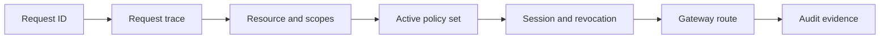

Use this guide when a request is denied, unexpectedly allowed, missing audit evidence, or routed to the wrong protected resource. For production incidents and dependency failures, use [Troubleshoot by Symptom](/v0.2/operations/troubleshooting/).

## Prerequisites

* The request ID, zone, application, resource, scopes, and approximate timestamp.
* Access to Audit and active policy-set status.
* A safe way to reproduce without changing production data.

## Debug Flow

## Start with the Request ID

Find the request ID from the SDK error, STS response, Gateway response, web console audit event, or application log. Open web console **Audit**, filter by the request ID, and open its decision trace.

The trace should show:

* application and execution session;
* requested resource and scopes;
* policy set version;
* determining policies;
* diagnostics;
* final decision;
* Gateway result when the request reached Gateway.

If you do not have a request ID, reproduce the request with your runtime configuration and capture the SDK, STS, or Gateway output.

## Common Authorization Failures

| Symptom                           | Check                                                                                     | Fix                                                                                        |
| --------------------------------- | ----------------------------------------------------------------------------------------- | ------------------------------------------------------------------------------------------ |
| Exchange is denied                | Active policy does not allow the application, subject, resource, or scopes.               | Update the Rego policy, simulate the denied input, and activate a new policy-set version.  |
| Scope is missing                  | Resource does not define the scope, or policy allowlist omits it.                         | Add the scope to the resource and policy deliberately.                                     |
| Wrong resource is evaluated       | App used the wrong resource ID or Gateway header.                                         | Use the resource ID from Console and `X-Caracal-Resource`.                                 |
| Policy change has no effect       | New policy version is not in the active policy-set version.                               | Create and activate a new policy-set version.                                              |
| Access continues after revocation | Resource server is not consuming revocation state, or Gateway route is not used.          | Confirm Gateway-mediated routing or shared revocation consumers for adapters.              |
| Gateway returns 403               | Mandate is expired, missing, revoked, or scoped for another resource.                     | Rerun the workload for a fresh mandate and confirm resource bindings.                      |
| Upstream succeeds without audit   | Request bypassed Gateway or adapter result audit.                                         | Route through Gateway or emit service-side action-result audit after adapter verification. |
| No audit event appears            | Request never reached STS/Gateway, wrong zone is selected, or audit ingestion is delayed. | Confirm profile, selected zone, and request ID; refresh audit after a short wait.          |

## Iterate from a Denial

Every denied decision links to the policy-set version that produced it, and the audit explain endpoint reconstructs a redaction-safe policy input you can replay against a candidate version before activating the fix. Follow [Iterate from real denials](/v0.2/guides/activate-policy-set/#iterate-from-real-denials) for the snippet and caveats, or run [Iterate Policy Safely](/v0.2/examples/policy-iterate/) to automate the loop.

## Authorization Design Rules

* Allow only the scopes an application and subject need.
* Keep policies resource-specific instead of allowing broad cross-resource access.
* Express context-sensitive conditions in policy rather than widening scopes.
* Revoke active sessions when a subject leaves a workflow or an application no longer needs a resource.
* Use diagnostics for expected denial paths so request traces explain what to change.

## Related Pages

* [Define Resources and Providers](/v0.2/guides/resources-providers/)
* [Author Policy Data](/v0.2/guides/author-policy/)
* [Activate a Policy Set](/v0.2/guides/activate-policy-set/)
* [Resources and Grants](/v0.2/concepts/resource-grant/)
* [Policies and Policy Sets](/v0.2/concepts/policy/)
* [Sessions and Revocation](/v0.2/concepts/sessions-revocation/)

## Validation and expected result

Reproduce once after correction. The trace must name the intended resource, Session/Delegation, active manifest, determining data, final decision, and Gateway result. A deny fix is complete only when nearby negative cases still deny.

:::caution[Failure point: changing several layers]
Do not edit resource scopes, policy data, application labels, and Gateway routing simultaneously. Trace from request ID inward and change the first incorrect boundary; otherwise the new allow cannot be explained.
:::

## Next Step

Use [Iterate Policy Safely](/v0.2/examples/policy-iterate/) for policy-data correction or [Check Provider Readiness](/v0.2/examples/provider-preflight/) for route/provider failures.
