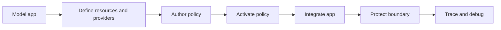

Use Guides after [Get Started](/v0.2/get-started/) when you have a concrete integration job. These pages teach complete application-integrator and resource-server workflows; package and API pages remain the source for signatures and wire fields.

## When to use this section

* **Application integrators** start with an SDK guide, then route outbound calls through Gateway or `caracal run`.
* **Resource-server integrators** start with Gateway routing or the adapter matching their server framework.
* **Platform integrators** use the modeling, resource/provider, policy, testing, and audit workflows before production traffic.

## Choose by Task

| Task                                                 | Start with                                                                                                                                                                                    |
| ---------------------------------------------------- | --------------------------------------------------------------------------------------------------------------------------------------------------------------------------------------------- |
| Map your architecture onto Caracal                   | [Model Your Application in Caracal](/v0.2/guides/modeling-recipes/)                                                                                                                                |
| Serve many of your own customers from one deployment | [Serve Your Own Customers](/v0.2/guides/serve-customers/)                                                                                                                                          |
| Define protected targets and upstream credentials    | [Define Resources and Providers](/v0.2/guides/resources-providers/) and [Provider Recipes](/v0.2/guides/provider-recipes/)                                                                              |
| Write and activate authorization logic               | [Author Policy Data](/v0.2/guides/author-policy/) and [Activate a Policy Set](/v0.2/guides/activate-policy-set/)                                                                                        |
| Debug an authorization result                        | [Debug Authorization Decisions](/v0.2/guides/authorize-access/)                                                                                                                                    |
| Add Caracal to app code                              | [TypeScript SDK](/v0.2/guides/sdk-typescript/), [Python SDK](/v0.2/guides/sdk-python/), or [Go SDK](/v0.2/guides/sdk-go/)                                                                                    |
| Run an existing process with Caracal tokens          | [Run an Agent with caracal run](/v0.2/guides/runtime-run/)                                                                                                                                         |
| Protect a Gateway-routed HTTP upstream               | [Protect a Gateway-Routed HTTP API](/v0.2/guides/protect-gateway-http/)                                                                                                                            |
| Protect a resource server in process                 | [Express](/v0.2/guides/protect-express/), [FastAPI](/v0.2/guides/protect-fastapi/), [FastMCP](/v0.2/guides/protect-fastmcp/), [Go net/http](/v0.2/guides/protect-nethttp/), or [MCP server](/v0.2/guides/protect-mcp/) |
| Add Delegation, audit export, or Approval            | [Delegation](/v0.2/guides/delegation/), [Audit Stream](/v0.2/guides/audit-stream/), or [Human Approval](/v0.2/guides/step-up/)                                                                               |
| Notify approvers when a hold is raised               | [Approval Notifications](/v0.2/guides/approval-notifications/)                                                                                                                                    |
| Make retries safe for side-effecting actions         | [Safe Retries and Idempotency](/v0.2/guides/idempotency/)                                                                                                                                         |
| Test an integration without a live stack             | [Test Caracal Integrations](/v0.2/guides/testing/)                                                                                                                                                 |
| Govern LangChain, LangGraph, or CrewAI               | [Govern Agent Frameworks](/v0.2/guides/frameworks/)                                                                                                                                                |
| Plan a production integration                        | [Production Integration Patterns](/v0.2/guides/production-patterns/)                                                                                                                              |

## Recommended Order

## Surface Boundaries

Use the right surface for each task:

| Surface                                                                       | Use for                                                                                                                        |
| ----------------------------------------------------------------------------- | ------------------------------------------------------------------------------------------------------------------------------ |
| `caracal up`, `down`, `status`, `upgrade`, `purge`, `allowlist`, and `run`    | Local runtime lifecycle, Console sign-in admission, and subprocess injection.                                                  |
| Console                                                                       | Human-facing zone, application, provider, resource, policy, session, audit, explanation, delegation, and diagnostic workflows. |
| Admin API and `@caracalai/admin`                                              | Automation for the same control-plane objects.                                                                                 |
| SDKs and adapters                                                             | Application integration, context propagation, mandate exchange, and mandate verification.                                      |

## Before You Start

You need a running Caracal runtime, a zone, an application, at least one resource, and an active policy set. [First Protected Call](/v0.2/get-started/first-protected-call/) creates that baseline.

## Expected Outcome

After following one path through the table, an allowed call reaches exactly one protected resource, a denied call fails before protected work runs, and both outcomes can be found by request ID in **Audit**.

:::caution[Common mistake]
Use the linked [SDK and package reference](/v0.2/sdks/) for exact release signatures. Guides own sequencing, boundary choices, validation, and recovery - not duplicate API catalogs.
:::

## Next Step

Choose the first unfinished job in **Choose by Task**. For a new integration, start with [Model Your Application in Caracal](/v0.2/guides/modeling-recipes/).
