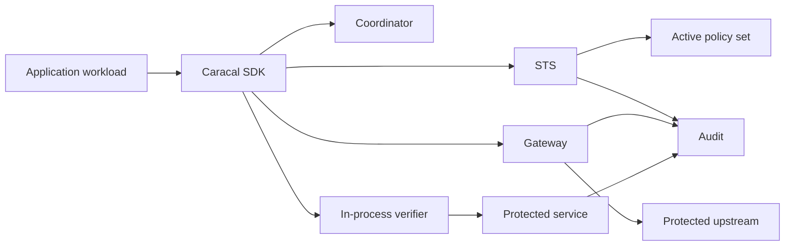

Use this review after one application and one protected resource work end to end. Production deployments combine a primary enforcement boundary with SDK lifecycle, shared revocation, policy rollout, audit export, and operational ownership.

## Prerequisites

* A tested allow, deny, revoke, and request-trace path.
* Named owners for application identity, resource verification, policy rollout, revocation, audit, and incidents.
* TLS, secret storage, shared revocation state, and timeout budgets appropriate to the deployment.

## Choose the Enforcement Boundary

| Boundary | Use when | Enforcement and result evidence |
| --- | --- | --- |
| Gateway-routed HTTP | Caracal can route the request before it reaches the upstream. | Gateway verifies, exchanges, routes, and records the upstream result. |
| Framework adapter | You own the resource server and must verify inside Express, ASGI, FastMCP, or Go `net/http`. | The service verifies before work and must emit its action result. |
| Verify engine | No supported adapter fits the service boundary. | Custom middleware uses the shared verifier and owns result evidence. |
| Runtime credential injection | An existing process needs a credential once at launch. | `caracal run` gates launch; it does not renew or enforce later provider calls. |

Use [Protect a Gateway-Routed HTTP API](/v0.2/guides/protect-gateway-http/) for the default HTTP path. Use the framework-specific protection guides when enforcement must live in the resource server.

## Reference Flow



## Identity and Configuration Boundaries

One SDK client represents one `(zone, application)` identity during concurrent use. Keep one client and one credential source per application boundary. Do not swap identities through a shared resolver while Sessions or transports are active.

On a shared host, give each service its own application, profile, and owner-only secret file:

```toml
zone_id = "0195f2a9-1b22-7c3d-9e4f-5a6b7c8d9e0f"
application_id = "anton"
app_client_secret_file = "/etc/caracal/anton.secret"
sts_url = "https://sts.pipernet.example"
gateway_url = "https://gateway.pipernet.example"

[[credentials]]
resource = "resource://pipernet"
```

Use a dynamic credential resolver only when one application credential is rotated or resolved externally. The next exchange can use the replacement credential; active identities still remain separate clients.

## Propagation into Other Protocols

Caracal SDKs project authority and trace context into HTTP headers. When another protocol carries equivalent metadata, inject the SDK-produced fields per call and verify the Mandate before the server performs work.

For gRPC, use a language-native client interceptor to copy the authorization and Caracal metadata into call metadata, then build server middleware around the verify package. Caracal does not ship gRPC middleware, service-mesh identity, or protocol-specific result audit.

A service mesh authenticates network peers; it does not replace Caracal resource scopes, policy decisions, Mandate verification, or revocation.

## OpenTelemetry Correlation

SDK transports preserve valid W3C trace context and add Caracal baggage. Gateway audit includes trace and request correlation. Validate that one APM trace can pivot to the corresponding Caracal request trace without treating tracing as an authorization control.

## Queue and Batch Work

Use a Session per governed unit of work. Supply an explicit idempotency key only when a durable source provides a stable delivery identifier. Caracal makes supported Coordinator creations replay-safe; it does not make arbitrary callbacks, queue consumption, or upstream mutations exactly once.

For long-running workers, use SDK-managed service Sessions and lease callbacks. Do not use `caracal run` credentials beyond their issued lifetime because the launcher never renews them.

## Production Checklist

| Area | Required evidence |
| --- | --- |
| Enforcement | A request cannot reach the protected action without Gateway or verifier acceptance. |
| Identity | Each application boundary has distinct credentials, clients, policy attribution, and rotation ownership. |
| Revocation | Shared consumers receive Session and Delegation invalidation; stale state fails according to the documented boundary. |
| Policy | Candidate versions validate and simulate, activation reaches every STS replica, and rollback is rehearsed. |
| Audit | Authorization and action-result evidence correlate by request or trace ID. |
| Approval | Gated scopes reach the intended operator or federated Subject decision plane. |
| Recovery | Dependency outages, audit replay, restore, and credential rotation are tested. |

## Validate After Rollout

Run a successful request, policy denial, verifier denial, revoked-Session request, replayed Gateway request, and Approval-gated request. Confirm expected HTTP or SDK errors and complete audit evidence.

In staging, interrupt STS, Redis revocation freshness, Audit delivery, and the upstream. Confirm access fails closed where authority cannot be proven and application retries remain bounded and mutation-safe.

## Next Step

Complete the focused guide for the selected enforcement boundary, then use [Operate Caracal](/v0.2/operations/) to deploy and monitor it.
