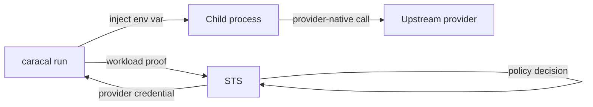

`caracal run` starts a local subprocess with short-lived **provider credentials** injected as environment variables: the brokered OAuth token or sealed API key of each bound resource's provider, released only after Caracal authorizes the launch. The child process then calls the provider directly with its native credential - the Gateway is not in this path. The workload carries only its workload ID and secret; the credential bindings live in the web console. Use it for development, demos, and controlled local runs of existing CLIs that read provider-native environment variables such as `OPENAI_API_KEY`.

Do not use it for a daemon that must renew credentials, for request-level Gateway enforcement, or as a process supervisor. When you want per-request policy checks, Gateway brokering, and action-result audit, use an SDK transport instead.

## Prerequisites

* A ready runtime, Launcher workload, owner-only workload secret, and at least one launch binding.
* A provider with `allow_runtime_injection=true` and an active policy permitting binding scopes.
* A child process that reads the configured environment variable and can finish before credential expiry.

## What a Binding Injects

A binding names an environment variable, a resource, and the scopes the policy decision is made against. What lands in the variable is the resource's **provider credential**:

| Provider kind | Injected value |
| --- | --- |
| `api_key`, `bearer_token` | The sealed static key or token itself. Scope selection gates whether Caracal releases it - the value still carries the provider's full authority. |
| `oauth2_client_credentials` | A brokered short-lived provider access token. |
| `none`, `caracal_mandate`, `http_basic`, `oauth2_authorization_code` | Never injected - the launch is refused for these kinds (`http_basic` is a two-part pair, authorization-code connections belong to a consenting user, and the other two have no injectable credential). |

Every eligible kind also requires `allow_runtime_injection=true` on the provider; it is off by default because injection moves enforcement of the actual call from the Gateway into your process.



## Prepare the workload

1. Run `caracal up`.
2. Sign in to the web console and use **Guided setup** to create the zone, provider, resource, and policy. Enable **runtime injection** on the provider.
3. On **Services → Launcher**, create a workload. Store its secret in the owner-only file at `<Caracal config dir>/runtime/<workload_id>/secret`, or export `CARACAL_WORKLOAD_SECRET`; the secret stays retrievable from the Launcher page, with every reveal audited.
4. On the same page, bind an environment variable to each resource the workload needs and select the scopes each policy decision should evaluate. The page then shows the exact launch commands. See [Configure Workloads](/v0.2/runtime-console/config-file/).

## Run a command

```bash
export CARACAL_WORKLOAD_ID=<workload_id>
caracal run -- npm start
```

The launcher fetches the workload's launch bindings from STS, requests the provider credential for each binding after a policy decision on only its selected scopes, and injects the results into the configured environment variables. The child environment is otherwise scrubbed: `CARACAL_*` configuration variables stay with the launcher, and only a small allowlist such as `PATH`, `HOME`, locale, and `XDG_*` directories is inherited. Credentials are obtained once at launch and never renewed; long-running workloads should use an SDK. If policy requires an Approval for a binding, the launch pauses and emits an `approval_required` line on stderr until the hold is decided. See [Run Workloads](/v0.2/runtime-console/runtime/) for the full contract.

## Validate the run

| Check | Command or surface |
| --- | --- |
| Runtime is ready | `caracal status --ready` |
| Credential is injected | `caracal run -- printenv OPENAI_API_KEY` (use your configured `env` name) |
| First request succeeds | Run the child once; it calls the provider directly with the injected credential. |
| Audit captured the launch | Web console **Audit** shows the credential-injection decision. |

Expected result: only configured binding variables and optional `<ENV>_EXPIRES_AT` values enter the child; workload identity and other `CARACAL_*` variables do not. The launcher exits with the child process's exit code.

## Troubleshooting

| Symptom | Fix |
| --- | --- |
| `workload identity not found` | Set `CARACAL_WORKLOAD_ID` and a workload secret source. |
| `invalid workload credentials` | The workload ID or secret is wrong or was rotated; copy the current values from **Services → Launcher**. |
| `no credential bindings configured` | Define launch bindings for this workload on **Services → Launcher**. |
| `does not allow runtime credential injection` | Enable runtime injection on the provider, or switch the resource to an injectable provider kind - see [What a Binding Injects](#what-a-binding-injects). |
| Secret file rejected | Restrict file permissions and avoid setting both inline and file secrets. |
| Launch pauses on `approval_required` | Decide the Approval in the web console, or adjust the approval tier in policy data. |
| Launch denied | Check policy-set activation, scopes, and audit diagnostics. |

:::caution[Failure point: scope versus provider credential]
Binding scopes govern whether STS releases a credential. A static upstream API key still carries its full provider-native power once injected. Prefer Gateway brokering when the upstream cannot issue a truly scoped credential.
:::

## Next Step

Run [Launch Research Agent](/v0.2/examples/research-agent/) for the fixed example, or migrate a long-lived process to the matching SDK guide ([TypeScript](/v0.2/guides/sdk-typescript/), [Python](/v0.2/guides/sdk-python/), [Go](/v0.2/guides/sdk-go/)).
