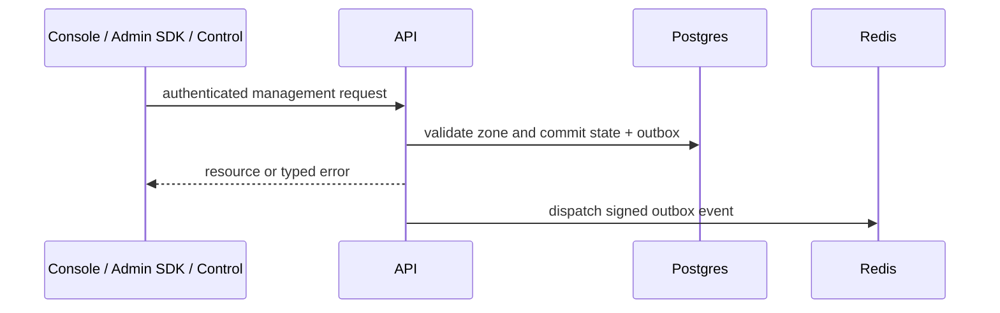

The API owns Zones, Applications, workloads, Providers, Resources, Policies, Policy sets, Grants, Subject issuers, Subjects, Authority records, Approval holds, admin audit, and related management state.

## Who Calls It

Human operators use the web console; its auth backend calls the API with derived operator credentials. Trusted automation uses the Admin SDK or documented `/v1` Admin API. The optional Control plugin dispatches into the same management implementation.

Workloads must not receive the API admin token or use management routes as a data-plane credential source.

## Runtime Contract

| Item                      | Local value          |
| ------------------------- | -------------------- |
| Port                      | `3000`               |
| Liveness                  | `GET /health`        |
| Readiness                 | `GET /ready`         |
| Metrics                   | `GET /metrics`       |
| Management prefix         | `/v1`                |
| Optional interactive docs | `/docs` when enabled |

Use [Use the Admin API](/v0.2/api/control-plane/) for route and auth reference rather than treating this service page as an endpoint catalog. Service environment variables are cataloged in [Configure Service Environment](/v0.2/operations/env-vars/).

## Write and Propagation Flow

The state change and outbox row commit together. Redis publication follows asynchronously. A successful API response can therefore precede policy reload, revocation, or audit consumption by a short interval.

## Failure Implications

| Failure                     | User impact                                                                                      |
| --------------------------- | ------------------------------------------------------------------------------------------------ |
| Postgres unavailable        | Reads/writes and readiness fail.                                                                 |
| Redis unavailable           | Readiness or outbox signals degrade; committed state remains in Postgres for retry.              |
| Dead/old outbox rows        | Consumers may retain stale policy, revocation, or audit state; Diagnostics surfaces the backlog. |
| Missing/invalid admin token | `401`; the console may report not connected or unauthorized.                                     |
| Valid token without scope   | `403`; narrow the operation or grant the required operator scope.                                |
| Secret backend unavailable  | Secret-bearing create, reveal, rotation, or dependent issuance fails closed.                     |

Do not call the API's STS-coordination or internal service routes directly. The owning console or Admin SDK workflow supplies the required authentication and validation.

## Next Step

[Coordinate Session State](/v0.2/services/coordinator/) or [Manage Product Objects](/v0.2/runtime-console/admin/).
