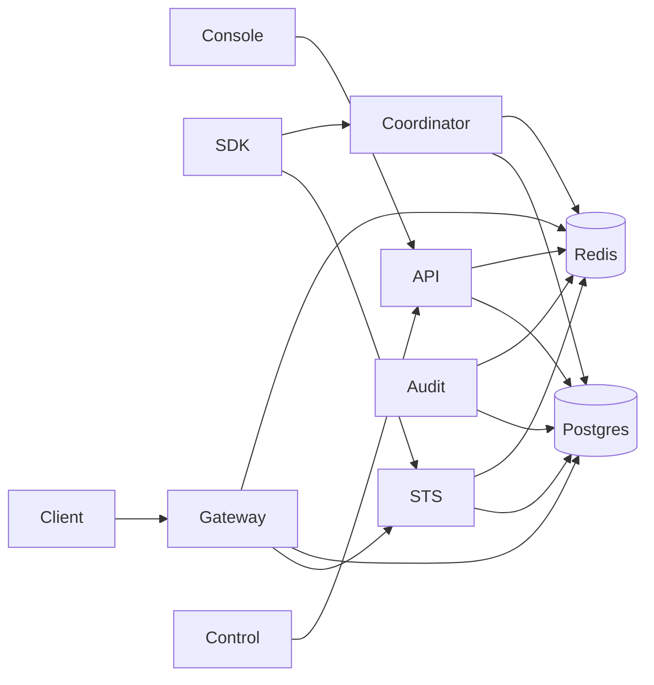

Use this section for integration boundaries and operations. It is not a requirement for ordinary console setup.

## Service Selection

| User-visible operation               | Service                               | Supported caller                                             |
| ------------------------------------ | ------------------------------------- | ------------------------------------------------------------ |
| Manage product and policy state      | [API](/v0.2/services/api/)                 | Console BFF, Admin SDK, documented Admin API                 |
| Start Sessions or create Delegations | [Coordinator](/v0.2/services/coordinator/) | SDK, documented Coordinator API, console operator views      |
| Exchange authority for a mandate     | [STS](/v0.2/services/sts/)                 | SDK, `caracal run`, Gateway, documented token client         |
| Protect an HTTP upstream             | [Gateway](/v0.2/services/gateway/)         | Client presenting a Caracal mandate                          |
| Ingest and retain decision evidence  | [Audit](/v0.2/services/audit/)             | Caracal stream producers; operators read through console/API |
| Automate zone management remotely    | [Control](/v0.2/services/control/)         | Trusted automation with a scoped Control credential          |

## Dependency Shape

The packaged Compose and Helm topologies deploy all five runtime services together with Postgres and Redis; Control is the only optional management surface. All five runtime services expose health and readiness. Health means the process responds. Readiness includes dependencies and service-specific thresholds. Control has no separate process: it is an optional plugin on the API port.

## Direct-Call Rule

Do not call `/internal/*` routes, write service tables, publish Redis topics, or manipulate replay directories from application code. Internal routes are authenticated service-to-service contracts. Use the console, SDKs, Admin API, Coordinator API, STS token endpoint, Gateway proxy, or Control API as documented.

## Next Step

[Manage Product State](/v0.2/services/api/) for the management path, or [Issue Mandates](/v0.2/services/sts/) for the authority path.
