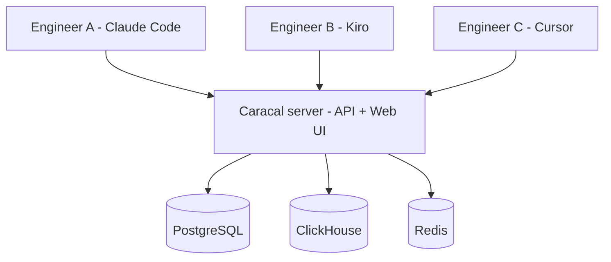

<!-- SPDX-FileCopyrightText: 2026 Ryan Madhuwala <rawx18.dev@gmail.com> -->
<!-- SPDX-License-Identifier: Apache-2.0 -->

# Run an organization agent registry

Once multiple developers are authoring Agents and MCP servers, you need a single source of truth. Caracal gives an Organization a registry for AI Resources, a review workflow for shared components, and project-scoped telemetry for debugging and adoption tracking.

## What changes at organization scale

* **Discovery**: members browse the same approved Agents, MCPs, Skills, Hooks, and Prompts.
* **Review**: project-scoped submissions go to the owning Project's leads; global reviewers can review across the deployment. Authors' own items remain usable by the author according to visibility rules.
* **Governance**: deployment roles (`operator`, `reviewer`, `user`) are separate from Organization roles (`owner`, `admin`, `member`) and Project roles (`lead`, `user`).
* **Visibility**: project-scoped traces and Project Intelligence replace ad hoc questions about which version is installed or why a session failed.

## Setup shape

Deploy once, everyone points at it.



Install the server once ([Self-Hosting](../self-hosting/README.md)). Then every engineer installs the CLI and runs `caracal auth login` pointed at your shared server URL.

## Users, roles, and projects

Current authority is split by scope.

| Scope | Roles | Used for |
| --- | --- | --- |
| Deployment | `operator`, `reviewer`, `user` | Instance operation and deployment-wide registry review |
| Organization | `owner`, `admin`, `member` | Organization membership and Project administration |
| Project | `lead`, `user` | Project Resources, project-scoped review, traces, and intelligence |

Manage users:

```bash
# Manage users in the web UI: Settings -> Users
# (list, reset passwords, change roles, delete accounts)
```

Change deployment roles via the web UI (`/settings/users`) or the API (`PUT /api/v1/operator/users/{id}/role`). Manage Organization and Project membership in the Organization settings surfaces.

## Onboarding a new engineer

Two commands to get them productive:

```bash
# The new engineer runs:
curl -fsSL https://raw.githubusercontent.com/Garudex-Labs/caracal/main/install.sh | bash
caracal auth login --server https://caracal.your-company.internal
```

For managed deployments, users authenticate through SSO or are provisioned by an operator; Organization owners/admins manage tenant membership. See [Authentication and SSO](../self-hosting/authentication.md).

After logging in, they can:

```bash
caracal agent list                           # see approved agents visible in the active context
caracal agent pull team-reviewer --harness claude-code # install one
caracal scan                                 # discover what they have installed
caracal doctor patch --all-harnesses        # instrument everything
```

## Review workflow

Authors submit. Reviewers approve. Approved items appear in the public or Project listing according to visibility.

Review, approve, and reject submissions in the web UI review queue; each item shows the full diff and provenance.

What reviewers look for:

* Does the README/description make it clear what the component does?
* Does the MCP analysis (from `submit`) look correct: tools, env vars, transport?
* Are required env vars documented?
* Is the repo URL trustworthy (pinned commit or tag)?

Authors can use their own submissions immediately. Review controls what appears to everyone else.

## Telemetry across the organization

Because every engineer's session telemetry flows into the same server and Project context, `caracal ops` and the web UI become shared debugging surfaces:

```bash
caracal ops top --type agent           # most-used agents
caracal ops top --type mcp             # hottest MCP servers
```

Filters in the web UI let you slice by user, agent, harness, and time range.

## SSO and audit considerations

For orgs that need SSO and audit logging, configure OIDC in **Admin -> SSO**:

| Setting | Value |
| --- | --- |
| `oauth.client_id` | Your IdP client ID |
| `oauth.client_secret` | Your IdP client secret |
| `oauth.server_metadata_url` | Your IdP discovery URL |

Restart the API after OIDC changes. See [Authentication and SSO](../self-hosting/authentication.md).

## Next

→ [Self-Hosting](../self-hosting/README.md): the operator's playbook for actually running the server this use case depends on.
